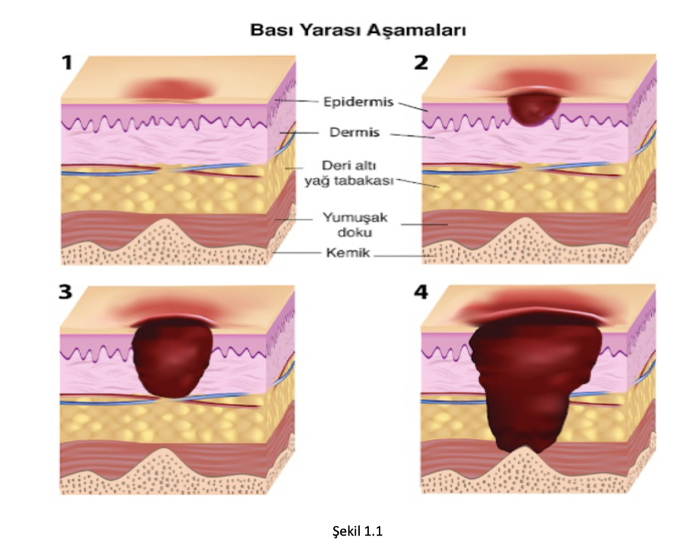

# DekubitusUlcersAssistant
Bası Yarası Tespit ve Tedavi Asistanı Bilgisayar Uygulaması 

**Giriş**
	Bası yaraları, özellikle yatağa bağımlı hastalarda sıkça görülen ciddi sağlık sorunlarıdır. Bu tür yaralar, yoğun bakım ünitelerinde, yaşlı bakım evlerinde ve evde bakım hizmetleri alan hastalarda meydana gelir. Bası ülseri genellikle kemik çıkıntıları üzerinde ya da tıbbi cihaz veya başka bir cihazla ilişkili olarak ortaya çıkan lokalize deri veya deri alt doku hasarıdır. Etkin bir risk tanılama ve bakımla bireyde gelişebilecek komplikasyonlar önlenir ve sağlık durumu daha da iyi hale getirilebilir. Hemşireler, bu hastaların bakımından sorumlu oldukları için bası yaralarının erken teşhisi ve etkili tedavisi büyük önem taşır. 
	Bası ülserleri sağlık bakım maliyetlerini artırıp hastanın hastanede yatış süresini uzatması, yaşam kalitesini azaltması yönünden etkili bir hasta bakımı ile büyük bir oranda önlenebilir, tedavi edilebilir. Bu tedavide birçok tıbbi cihaz, ilaç, koruyucu medikal materyaller yanı sıra teknolojik olanaklardan da yararlanılmaya çalışılmaktadır. Bu bağlamda tıbbi tedavilerde yapay zeka araçları kullanımı da yaygınlaşmaktadır. Bu çalışmayla özellikle yoğun bakım ünitelerinde bası ülserlerini bir bilgisayar uygulaması vasıtasıyla yaranın evresini belirlemek ve uygun tedavi yöntemini önererek bakımın kolaylaştırılması ve etkin bir tedavi geliştirilmesi amaçlanmıştır. 
				
						Bası Ülserleri Evreleri

**Evre I:** Koyu renk tenli kişilerde tanımlanması zor olan, basmakla kızarıklığı solmayan, bütünlüğü bozulmamış cilt. His, ısı ya da sertlik görsel değişikliklerden önce 		    hissedilebilir. Derin doku yaralanmasına işaret eden kahverengi ya da mor renk değişiklikleri oluşmayabilir.( Şekil 1.1)   
**Evre II:** Yara yatağı kırmızı ya da pembe renkte, canlı, nemli ve su dolu kabarcık olarak görünür. Granülasyon dokusu, kabuk ya da skar yoktur. Bu yaralanma daha çok pelvis üstü ya da topuktaki sürtünme ya da havasızlıktan kaynaklanır .( Şekil 1.2)   
**Evre III:** 
Tam Kalınlıkta Deri Kaybı: Cilt al3 yağ dokusu görülebildiği ülser ya da granülasyon dokunun bulunduğu deri kaybıdır. Kabuk ya da skar görülebilir. Doku hasarının derinliği anatomik bölgeye göre değişebilir; geniş hacimli yağ bölgelerinde derin doku hasarı görülebilir. Fasya, kas, tendon, ligament, kıkırdak ya da kemik açıkta değildir.( Şekil 1.3)   
**Evre IV:** 
Tam Deri ve Doku Kaybı: Kemik, tendon ve kas dokusunun da etkilendiği tam bir doku kaybı mevcuttur. Derinliği ülserin geliş1ği anatomik bölgeye göre değişiklik gösterir. Genellikle cep ve tüneller içerir. ( Şekil 1.4)  

**Amaç**
	Yazılım, hastaların cilt yüzeyindeki bası yaralarını hızlı ve doğru bir şekilde teşhis etmeyi amaçlamakla kalmayıp aynı zamanda bu yaraların tespiti ve tedavisi için ortak bir yaklaşıma odaklanmayı hedefler. Erken teşhis, hastaların tedaviye daha erken erişmelerini ve olası komplikasyonların önlenmesini sağlayacaktır. Yazılım, tespit edilen yaraları doğru bir şekilde sınıflandırarak hangi evrede olduklarını belirlemeyi hedefler, bu da hastaların tedavi planlarının kişiselleştirilmesine ve etkili bir şekilde uygulanmasına yardımcı olur. Tespit edilen yara evresine göre, hastalara uygun tedavi önerileri sunulur, bu da sağlık profesyonellerine ve hastalara uygun bakım sağlama konusunda rehberlik eder. Ayrıca, hastaların verileri güvenli bir şekilde saklanır ve erişilebilir hale getirilir, bu da hastaların tedavi sürecini izlemek ve gelecekteki analizler için verilere erişim sağlamak için önemlidir. Bu bütüncül yaklaşım, bası yaralarının yönetiminde etkin ve güvenilir bir çözüm sunmayı amaçlamaktadır.

**Yazılımın Teknolojik Altyapısı**
Bu yazılımın temel bileşenleri ve teknolojik altyapısı aşağıda açıklanmıştır: 
	**YoloV4:** Yazılım, yara tespiti için YoloV4 (You Only Look Once) adlı derin öğrenme modelini kullanır. YoloV4, nesne tespiti ve sınıflandırma için etkili bir modeldir. Model, nesneleri tespit edip sınıflandırmak için görüntülerde dolaşır ve böylece bası yaralarını tanımlar.
	**OpenCV (Open Source Computer Vision Library):** Görüntü işleme ve analizi için OpenCV kütüphanesi kullanılır. Yara tespiti için görüntüler üzerinde işlem yapar ve YoloV4 modeli ile entegre edilir.
	**Qt ve PyQt5:** Kullanıcı arayüzü (UI) tasarımı ve hastaların bilgilerinin görüntülenmesi için PyQt5 kullanılır. Bu, kullanıcıların yazılımı etkileşimli bir şekilde kullanmalarını sağlar.
	**SQLite Veritabanı:** Hastaların bilgileri, yara tespiti sonuçları ve tedavi önerileri veritabanında saklanır. Bu, verilerin güvenli bir şekilde saklanmasını ve gelecekteki analizler için erişilebilir olmasını sağlar.

**Transfer Öğrenme (Transfer Learning)**
Bası yarası tespiti için, transfer öğrenme kullanılır. Transfer öğrenme, önceden eğitilmiş bir modelin ağırlıklarının yeni bir görev için özelleştirilmesini içerir. İşte bu sürecin detayları: 
	**Önceden Eğitilmiş Model:** Transfer öğrenme işlemi, birçok nesne tespiti görevini başarıyla gerçekleştiren bir YoloV4 modelini içerir. Model eğitiminde farklı evrelerde bası yarası fotoğraflarını içeren 500 adet görsel data augmentation yöntemi ile çoğaltılarak elde edilen  2000 adet bası yarası fotoğrafı ile eğitilmiştir. Bu model, genel nesne tespiti yetenekleri kazanmıştır. 
	**İkincil Görev (Bası Yara Tespiti):** İkincil görev, yazılımın ana amacı olan bası yarası tespitini içerir. YoloV4 modeli, bu ikincil görev için özelleştirilir. Modelin ağırlıkları, bası yara tespiti görevi için yeniden eğitilir. 
	**Veri Toplama ve Etiketleme:** Yara tespiti için uygun eğitim verileri web ortamında deneyimli bir yoğun bakım hemşiresi tarafından toplandı ve evrelerine göre etiketlendi makesense.ai  web adresinde .xml formatında export edildi. 
	**Eğitim ve Ayarlar:** Özelleştirilmiş model, toplanan ve etiketlenen bası yara görüntüleri üzerinde, Colaboratory’de eğitildi. Colaboratory, Google tarafından geliştirilen bir bulut tabanlı araçtır. Colab, Python programlama dilini kullanarak interaktif ortamda veri analizi, makine öğrenimi ve araştırma projeleri yapmayı sağlar. Bu süreç, modelin yara tespit görevini öğrenmesini sağlar.
	**Tespit:** Eğitilen model, yeni görüntülerde bası yaralarını tespit etmek için kullanılır. Model, tespit edilen yaraların evrelerini belirler ve tedavi önerilerini sunar.

**Yazılımın İşleyişi**
Yazılımın çalışma süreci aşağıdaki adımlardan oluşur:
	Görüntü İşleme ve Yara Tespiti: Kullanıcı, bir görüntüyü yazılıma yükler. Yazılım, YoloV4 modeli aracılığıyla görüntüyü işler ve bası yaralarını tespit eder ve uygulama üzerinde yüklenme tarihine göre kullanıcıya gösterir.
	Yara Evresi Belirleme: Tespit edilen yaralar, hangi evrede olduklarına göre sınıflandırılır. Bu sınıflandırma sonuçları yazılım tarafından kaydedilir.
	Tedavi Önerileri: Yara evresine göre hastaya uygun tedavi önerileri sunulur. Tedavi planları kullanıcıya görüntülenir.
	Bilgi Kayıt ve Saklama: Hastaların bilgileri ve tedavi sonuçları SQLite veritabanında saklanır. Bu, hastaların takip edilmesi ve verilere erişim sağlanması için önemlidir.

**Sonuç**
	Bası Yarası Tespit ve Tedavi Yardımcı Yazılımı, bası yaralarının erken teşhisini ve etkili tedaviyi teşvik etme misyonunu başarıyla yerine getirir. Transfer öğrenme, yazılımın başarısını artıran kritik bir bileşen olarak değerlendirilebilir. Bu yazılım, sağlık profesyonellerine ve hastalara önemli bir yardım sağlayarak bası yaralarının etkilerini azaltmaya yardımcı olur.

**Uygulama görselleri;**

